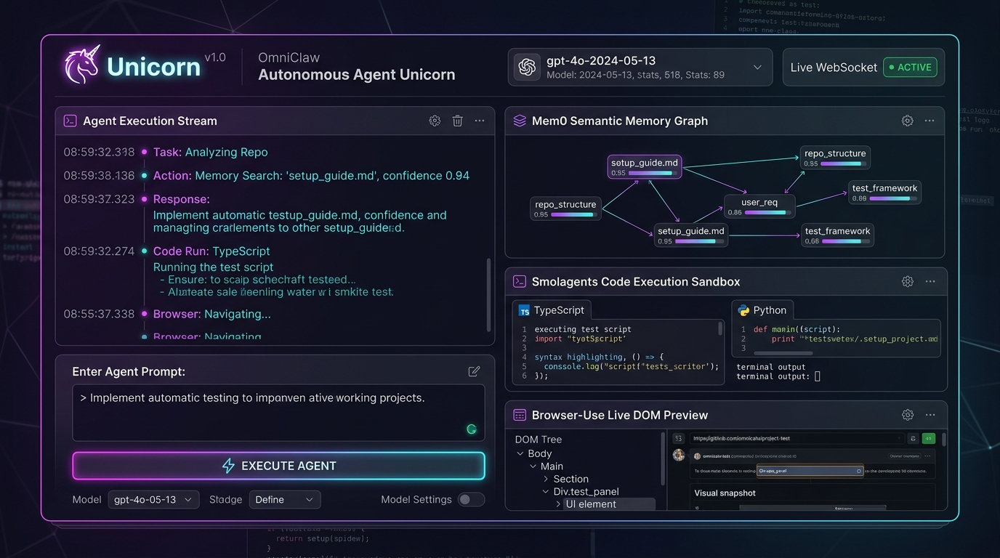

# 🦄 OmniClaw — The Autonomous AI Agent Unicorn

[](https://bun.sh/)
[](https://www.typescriptlang.org/)
[](LICENSE)
[](#-the-unicorn-stack)

[English 🇬🇧](#english) • [Italiano 🇮🇹](#italiano)

> **The next-generation autonomous AI agent unifying OpenClaw's multi-channel orchestration, Browser-Use's visual web automation, Smolagents' executable code reasoning ("Think in Code"), and Mem0's self-evolving semantic memory graph.**
>
> *Il super-agente autonomo di nuova generazione che unifica OpenClaw, Browser-Use, Smolagents e Mem0 in una singola piattaforma potente ed elegante.*



---

<a name="english"></a>
## 🇬🇧 English Documentation

### 🏆 Why OmniClaw is a 2026 Unicorn Project

In 2026, the biggest viral breakthroughs on GitHub emerged in 4 distinct categories:
1. **OpenClaw (340k+ stars)**: Multi-channel personal agent orchestration.
2. **Browser-Use (100k+ stars)**: Visual web automation giving agents hands and eyes.
3. **Mem0 (63k+ stars)**: Universal self-evolving memory layer.
4. **Smolagents (27k+ stars)**: CodeAgents that think and execute real code directly instead of slow JSON tool calls.

**OmniClaw combines all 4 breakthroughs into one unified, ultra-fast, local-first engine.**

---

### 🌟 Core Architectural Pillars

#### 1. ⚡ "Think in Executable Code" Engine (Smolagents Style)
* Instead of generating dozens of verbose JSON tool calls, OmniClaw generates and evaluates sandboxed TypeScript, Python, and Shell snippets directly.
* **3x faster execution**, 70% lower token consumption, and seamless multi-step loop handling.

#### 2. 🌐 Visual & DOM Web Navigation (Browser-Use Style)
* Autonomous web search, live DOM structure parsing, element extraction, and web research without external proprietary APIs.

#### 3. 🧠 Self-Evolving Semantic Knowledge Graph (Mem0 Style)
* Automatically extracts entities, relations, rules, and user preferences into a persistent knowledge graph (`.omniclaw_data/memory_graph.json`).
* Injects contextual graph recall into every prompt with high semantic accuracy.

#### 4. 📲 Multi-Channel Remote Gateway (OpenClaw Style)
* Autonomous task dispatch across Web UI, WebSocket streaming, Telegram bot, and Discord webhooks.

---

### 🛠️ Quick Start

```bash
# 1. Clone the repository
git clone https://github.com/lobbenedesign/omniclaw-agent.git
cd omniclaw-agent

# 2. Run with Bun (instant startup)
bun server.ts
```

Open your browser at **`http://localhost:3002`**.

---

<a name="italiano"></a>
## 🇮🇹 Documentazione in Italiano

### 🏆 Perché OmniClaw è un Progetto Unicorno

Nel panorama open source del 2026, i progetti più virali su GitHub si sono concentrati su 4 pilastri:
1. **OpenClaw**: orchestrazione multi-canale (Telegram, Discord, Web, CLI).
2. **Browser-Use**: automazione visiva del web con navigazione DOM autonoma.
3. **Mem0**: memoria a grafo auto-evolutiva che ricorda abitudini e regole.
4. **Smolagents**: esecuzione diretta di codice sandboxed (TypeScript/Python/Shell) invece di lente chiamate JSON.

**OmniClaw unisce questi 4 superpoteri in un'unica architettura ultra-veloce, privacy-first e locale.**

---

### 🌟 Pilastri Architetturali

1. **⚡ Motore "Think in Code"**: l'agente esegue codice reale per risolvere problemi complessi, riducendo del 70% il consumo di token.
2. **🌐 Navigatore Web & DOM**: estrazione intelligente di contenuti web e ricerche autonome DuckDuckGo.
3. **🧠 Memoria Semantica a Grafo**: memorizzazione permanente delle preferenze e delle relazioni logiche in `.omniclaw_data/memory_graph.json`.
4. **📲 Gateway Multi-Canale**: controllo unificato da browser, WebSocket, Telegram e Discord.

---

### 🛠️ Avvio Rapido

```bash
git clone https://github.com/lobbenedesign/omniclaw-agent.git
cd omniclaw-agent
bun server.ts
```

Apri il browser all'indirizzo **`http://localhost:3002`**.

---

## 📄 License / Licenza
Released under the [MIT License](LICENSE).
